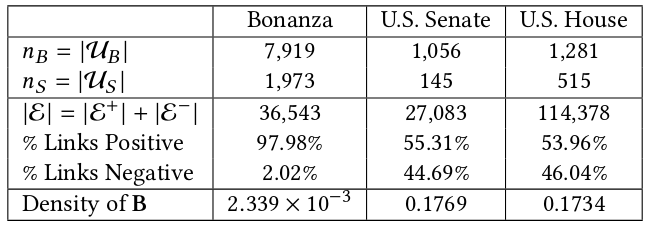

# Balance in Signed Bipartite Networks

#### Authors: [Tyler Derr](http://www.TylerDerr.com) (derrtyle@msu.edu), Cassidy Johnson(c_johnson49@u.pacific.edu), [Yi Chang](http://www.yichang-cs.com/)(yichang@jlu.edu.cn), and [Jiliang Tang](http://www.cse.msu.edu/~tangjili)(tangjili@msu.edu)

### Abstract

A large portion of today's big data can be represented as networks. However, not all networks are the same, and in fact, for many that have additional complexities to their structure, traditional general network analysis methods are no longer applicable. For example, signed networks contain both positive and negative links, and thus dedicated theories and algorithms have been developed. However, previous work mainly focuses on the unipartite setting where signed links connect any pair of nodes. Signed bipartite networks on the one hand, are commonly found, but have primarily been overlooked. Their complexities of having two node types where signed links can only form across the two sets introduce challenges that prevent most existing literature on unipartite signed and unsigned bipartite networks from being applied. On the other hand, balance theory, a key signed social theory, has been generally defined for cycles of any length and is being used in the form of triangles for numerous unipartite signed network tasks. However, in bipartite networks there are no triangles and furthermore there exist two types of nodes. Therefore, in this work, we conduct the first comprehensive analysis and validation of balance theory using the smallest cycle in signed bipartite networks - signed butterflies (i.e., cycles of length 4 containing the two node types). Then, to investigate the applicability of balance theory aiding signed bipartite network tasks, we develop multiple sign prediction methods that utilize balance theory in the form of signed butterflies. Our sign prediction experiment on three real-world signed bipartite networks demonstrates the effectiveness of using these signed butterflies for not only sign prediction, but paves the way for improvements in other signed bipartite network analysis tasks.

### Overview

This directory contains code necessary to run the analysis and experiments of the "Balance in Signed Bipartite Networks" paper. 
More specifically, the analysis on the undirected signed butterfly isomorphism classes and the sign prediction methods: 

##### Without Balance Theory

* Degree Based Supervised Classifier (SCd)
* Matrix Factorization (MF)
* Lazy Random Walk (LazyRW)

##### With Balance Theory

* Signed Catterpillars Based Supervised Classifier (SCsc)
* Matrix Factorization with Balance Theory (MFwBT)
* Signed Bipartite Random Walk (SBRW)

### Datasets

The structure of the datasets are as follows:

nB nS |E|

  

...

where . 

If you make use of this data and/or code in your work, please cite the following paper:

    @inproceedings{derr2019bipartite,
     author = {Derr, Tyler and Johnson, Cassidy and Chang, Yi and Tang, Jiliang},
     title = {Balance in Signed Bipartite Networks},
     booktitle = {Proceedings of the 28th ACM International Conference on Information and Knowledge Management (CIKM)},
     year = {2019},
     pages = {1221--1230},
     publisher = {ACM}
    } 

See our [paper](http://www.cse.msu.edu/~derrtyle/papers/cikm2019-signed_bipartite_networks.pdf) for details on the datasets and/or algorithms.

## Data now available and code coming soon!
